:banner: banners/subscription.jpg

**Subscriptions**
=================

All new clients can go to your Website and choose one of your predefined products in the 'Shop' section (e.g. POS+CRM, Project (Task Manager), Ecommerce).

Products can be created in the ``Sales >> Products`` section of your SaaS portal.
Each product is related to a Plan.

Trial database
_______________

If you click on the *Try Trial*, you will redirect to the login page (we recommend
to logout from admin user before clicking on it to check how your client can do
that):

* If client has been signed in website, he can input his credentials and login.
* If not, client will be able to sign up ('Sign Up' button)

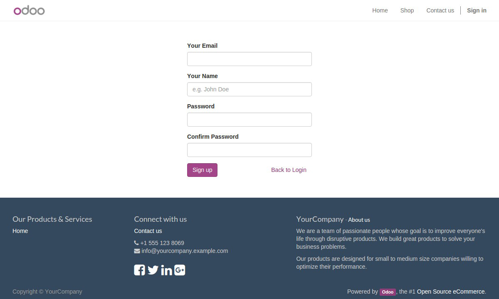

Then client can see the message:

"The database is creating...
it takes only a few minutes. Please check your email now for further instructions on how to
login."

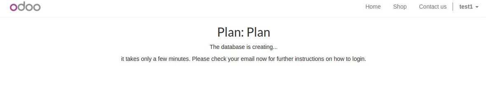

At this moment the client receives email that contains the created database
link.

As a result a new client database will be created and displayed in the Portal
(you can see them all at ``SaaS >> Clients`` section after deleting the *In Progress*
filter at the top-right hand of this menu). Then open this database and click on
the *Sync Server* button to sync client databases with server.

Paid database
_____________

If you want to sale subscriptions, you should add subscription values for your
products firstly:

* Period
* Number of users

Please take a look how to do it in the following instruction:

1: In ``Sales >> Sales >> Product >> [Your Product]`` Variants tab create Attributes:

* "Period" with values: Monthly, Quarterly, Yearly
* "Number of users" with values: 1,2,3,…
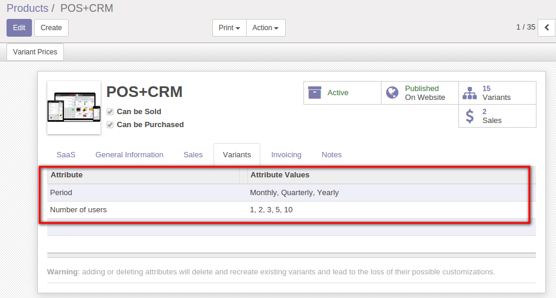

2: Press *Variant Prices* key. There you should set Saas code values as

30 for Monthly

90 for Quarterly

365 for Yearly

1 for 1

2 for 2

3 for 3

etc.

Attribute Price Factor should be 1.0 for all Periods. For Number of users it
should be the number of users.

Attribute Price Extra should be 0.0 for all Number of users and for Periods set
this parameter as you wish.

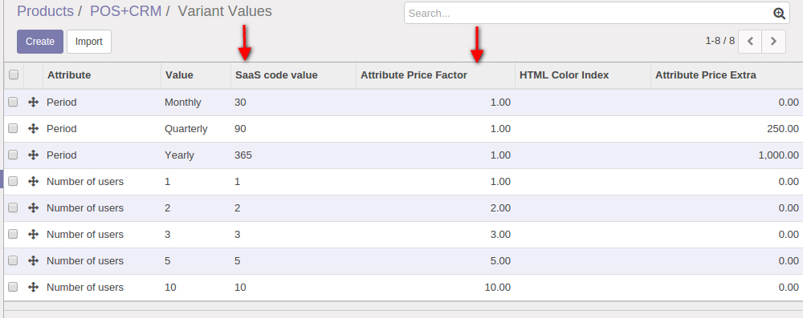

3: Go to the ``Sales >> Configuration >> Products >> Attributes``

and set Saas code as

SUBSCRIPTION_PERIOD for Period

and

MAX_USERS for Number of users.

There you can also specify Type of selection Radio/Select for the website.

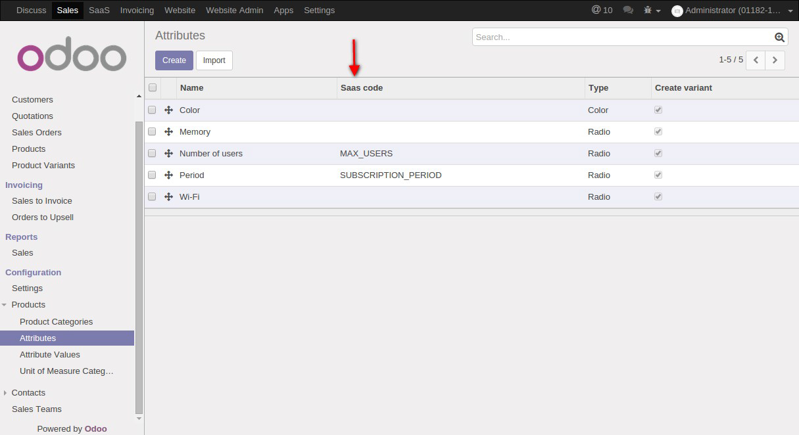

4: Go to the shop

Now you can select Period and Number of users and see how
the price changes accordingly.

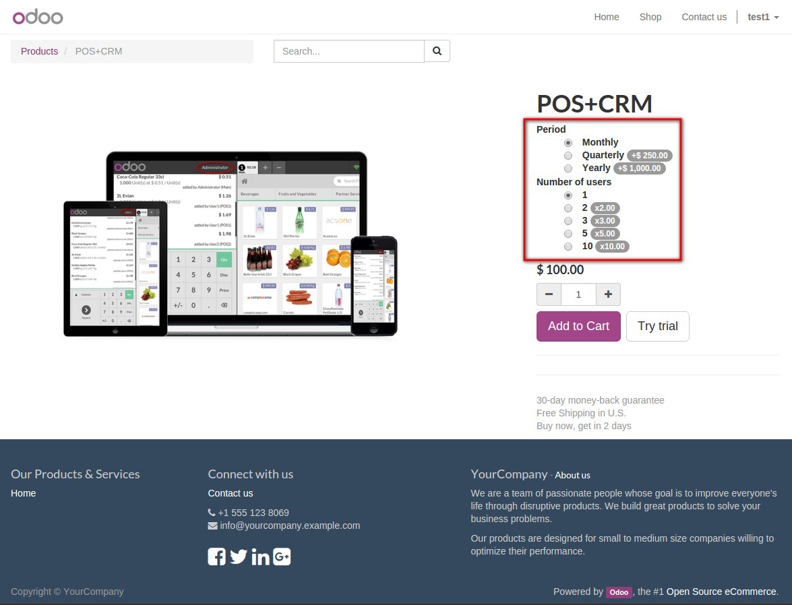

5: Click on the *Add to Cart* button and complete all the steps:

``Review Order >> Shipping & Billing >> Payment >> Confirmation``

*Review Order*

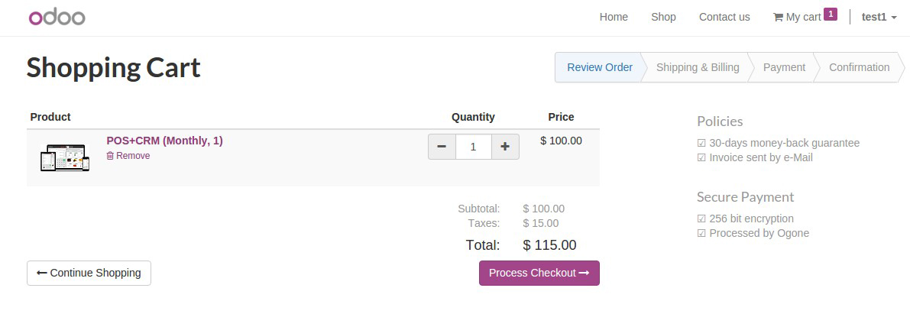

*Shipping & Billing*

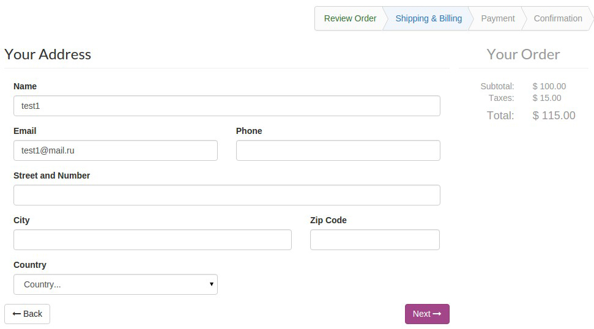

*Payment*

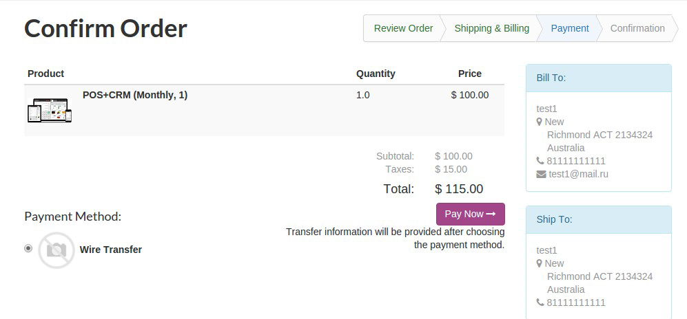

*Confirmation*

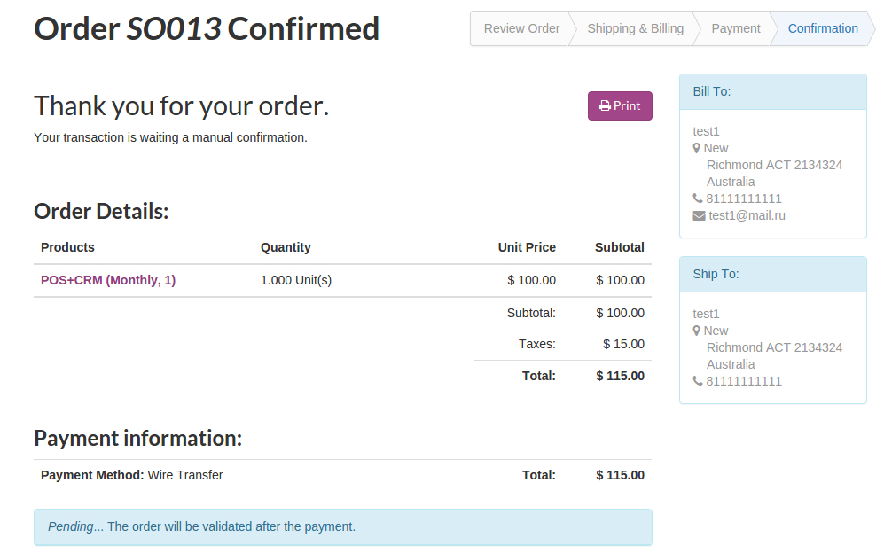

6: Go to the SaaS Portal and open ``Sales >> Sales >> Quotations``

* Open quotation and click 'Confirm Sale'

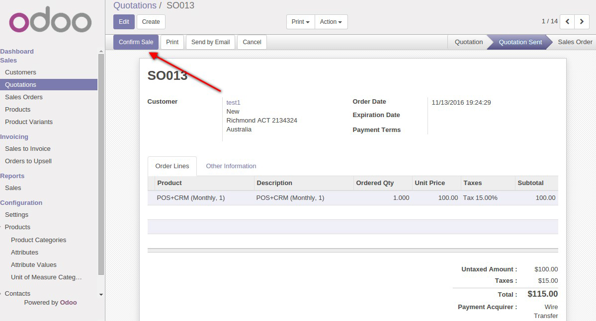

* Click 'Create Invoice'

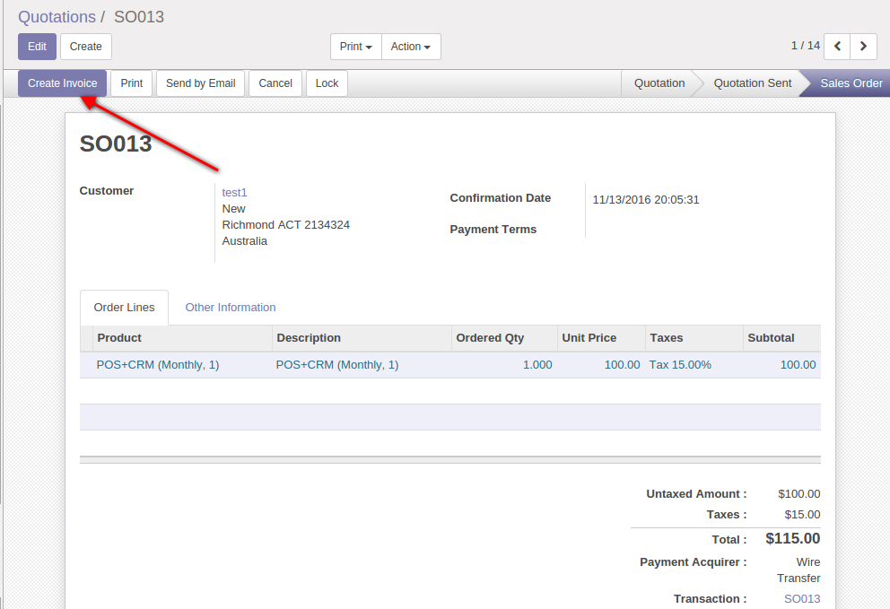

* Validate the invoice and Register Payment

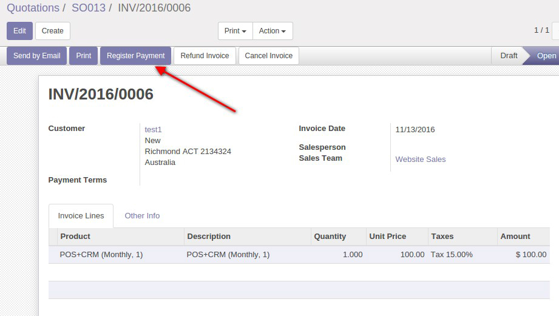

7: Once the Invoice is paid

* if the client has trial database already, the Maximum users allowed and
the Expiraton datetime parameters will be updated in the client database (note
that in this case in the corresponding plan you need to choose 'From trial' in the
**Non-trial instances** field)

* if it is a new client, he will receive the link on his email like this (the link
can be found also in the corresponding invoice):
http://your_saas_base_domain/page/start?plan_id=1
After clicking on it, he can choose domain name and create database

.. image:: ../images/15.jpg

As a result you can see new database in ``SaaS >> SaaS >> Clients`` menu (to see
that you should login as Administrator and delete the *In Progress* filter at the
top-right hand of this menu. This allows to see New client databases).

